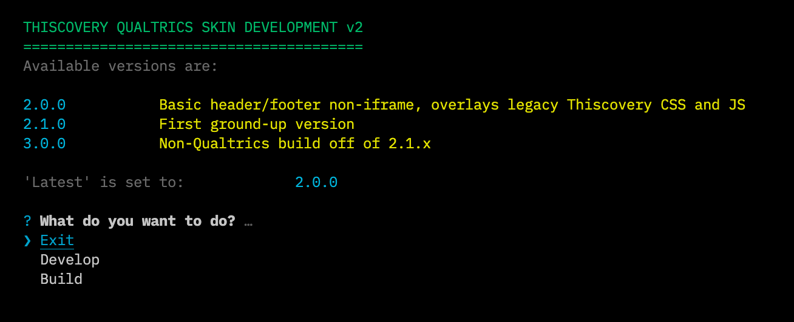

# qualtrics-thiscovery-skin
Javascript and CSS to customise Qualtrics surveys

Outputs:

- /dist/bundle.{version}.min.js
- /dist/bundle.{version}.min.css

- [Versions](#versions)
- [Installation](#installation)
- [Development and Building](#development-and-building)
- [Deployment](#deployment)
- [Repo Structure](#repo-structure)
- [Tools](#tools)
- [Troubleshooting](#troubleshooting)

## Versions

- 2.0.0 - simple header and footer over existing CSS shims (so requires both sets of CSS and js in header snippet) - this is still used in most live surveys
- 2.1.0 - new ground-up rewrite of the skin CSS (ie. not using existing CSS and JS, so will be backwardly _incompatible_ with older surveys) - new projects will start to use this skin
- 3.0.0 - takes all CSS from 2.1.x but strips it of Qualitrics styles (anything '.Skin *' as selector) - not in any production use yet

## Installation

Requires node.js 16+ and npm 6+ (bundled in node) - in the cloned repo run:

```npm install ```

## Development and Building

Run the `dev` script to get started (either with `npm run dev` or in your VDE of choice). You should see the following:

   

### Develop

You will be asked to provide a URL to open (usually a Qualtrics anonyomous distribution link) or a local file path.  You will also be asked which version to watch (make sure it is the same as the survey you are working on), then given a choice of browser to open.  You are also asked whether to start a SkinJob server to work on live CSS (see more below).

The script starts up [Browser-Sync](https://browsersync.io/) server to the given options, and starts watching CSS and JS _across all versions_ (because of shared components) and will rebuild _JS only_ on changes (this is because it is presumed live changes in CSS are done via SkinJob, and to stop constant page reloads).

**NB** By default the browsersync server uses 3000 - if you have a conflict, run the initial command as `npm run dev [port]` to use an alternative.

If SkinJob is set up properly, you should see instant changes to CSS (providing there is no conflict with the built version - disable bundle...css in the dev tools to debug). Wehn saving pages to the relevant JS, the page should reload.

### Build

The script will clarify which version you want built (although remember JS changes will already have been made in dev - roll back `/src` if necessary), or you can build all versions.

Build recipe is currently:

1. Compile SCSS into `skin.css`
2. Run `css_postprocess.js` on the version requested - this is currently autoprefixer and cssnano for all versions, and a strip-out of Qualtric styles for v3.0.0
3. Build and minify JS using esbuild (command is `build:js` defined in `package.json` if you need to edit options)
4. Make a copy of CS and JSS as `bundle.latest` based on the version set as `latest_alias` in package.json<sup>1</sup>

_<sup>1</sup>This is a build-step just for creating a 'latest' package designed for prefetch in the tasks page on the thiscovery site. Doesn't look like it's been implemented anyway so don't worry about it, just included in case._

## Deployment

Merging the repo currently triggers an automatic action in AWS to copy dist to the serving S3 container.  These are then accessible currently via a URL like so:

`https://thiscovery-skin.s3.eu-west-1.amazonaws.com/dist/bundle.[X.X.X].[css|js]`

So in a Qualtrics, the JS needs to be included as a `<script>` tag in the survey header HTML, and the CSS can be linked under 'External CSS' (both found under the 'Look and Feel' options).

<hr>

## Repo Structure

   ```
   src
├── md
|  ├── cookies.md
|  ├── personal_information.md
|  ├── terms_of_participation.md
|  └── terms_of_use.md
├── shared_js
|  ├── expand_textarea.js
|  ├── link_buttons.js
|  ├── ranking_question.js
|  ├── skinjob_client.js
|  └── thisco_modals.js
├── v2.0.0
|  ├── css
|  |  ├── components
|  |  |  ├── base.scss
|  |  |  ├── buttons.scss
|  |  |  └── policy-modals.scss
|  |  ├── skin.css
|  |  ├── skin.css.map
|  |  └── skin.scss
|  └── js/skin.js
├── v2.1.0
|  ├── css
|  |  ├── components
|  |  |  ├── base.scss
|  |  |  ├── buttons.scss
|  |  |  ├── forms.scss
|  |  |  ├── modals.scss
|  |  |  ├── panels.scss
|  |  |  ├── policy-modals.scss
|  |  |  ├── ranking.scss
|  |  |  └── scales.scss
|  |  ├── skin.css
|  |  ├── skin.css.map
|  |  └── skin.scss
|  └── js/skin.js
└── v3.0.0
   ├── css
   |  ├── skin.css
   |  ├── skin.css.map
   |  └── skin.scss
   └── js/skin.js

```


<hr>

## Tools

### Setting up 'skinjob'

This is the node script to run fast reloading and development of the main skin stylesheet. It runs a websocket server watching the local css file for changes, then prompts the browser to replace the CSS (without reloading). The `dev` script will ask if you want to run it as well as the other watches when selecting the 'develop' option. 

To run it independently, run:

```npm run skinjob [path to css sheet]```

and to see possible options:

`npm run skinjob help`

The command currently watches `src/css/skin.css`. (So when dev rebuilds the SCSS to skin.css, this triggers skinjob)

1. Add a `thisco_dev=anything` key-value-pair to localStorage in the browser developer tools (usually under 'Application' or 'Storage') and reload survey. This activates the snippet in the js listening for the websocket.  
2. Browsers will probably need some flags set to allow the comms to happen.  eg. in Firefox (recommended), in `about:config` set both `layout.css.constructable-stylesheets.enabled` and `network.websocket.allowInsecureFromHTTPS` to true (though remembers the latter flag needs switching off again at some point for security!).

**************

## Troubleshooting

- dev.js does include polyfills, but still make sure you're on as recent a version of node as possible
- double-check you are developing to the right version to match your Qualtrics survey or test page